# TestAI - Architecture & Agent Collaboration Guide

## 🎥 Demo Video

[](https://youtu.be/SYe6b5NQmDI)

> **See TestAI in action!** Watch our comprehensive demo showcasing the complete interview workflow, from candidate interaction through AI agent collaboration to final report generation.

### What you'll see in the demo:
- 🎯 **Multi-agent interview orchestration** - How 5 specialized AI agents collaborate
- 🔧 **RAG-powered technical questions** - Knowledge-grounded technical assessments
- 🤝 **Behavioral evaluation** - STAR methodology for soft skills assessment
- 📊 **Real-time scoring** - Automated analysis and recommendation generation
- 🖥️ **Modern web interface** - Angular frontend with responsive design
- 📋 **Professional reports** - PDF generation with comprehensive candidate evaluation

---

## 📋 Table of Contents
- [System Overview](#system-overview)
- [AI Agent Architecture](#ai-agent-architecture)
- [Agent Collaboration Workflow](#agent-collaboration-workflow)
- [Frontend Architecture](#frontend-architecture)
- [Backend Architecture](#backend-architecture)
- [Data Flow & Communication](#data-flow--communication)
- [Technology Stack](#technology-stack)
- [Configuration & Extensibility](#configuration--extensibility)

## 🎯 System Overview

TestAI is an intelligent interview platform that leverages a multi-agent AI system powered by CrewAI to conduct comprehensive technical and behavioral assessments. The system orchestrates specialized AI agents through a structured workflow, supported by a modern Angular frontend and FastAPI backend.

### Key Features
- **Multi-Agent Interview System**: Specialized AI agents for different interview phases
- **RAG-Enhanced Technical Questions**: Knowledge-grounded technical assessments
- **Real-time Web Interface**: Interactive Angular frontend with live question/answer flow
- **Comprehensive Reporting**: Automated report generation with scoring and recommendations
- **Flexible Configuration**: YAML-based agent and task configuration
- **Dual Execution Modes**: CLI for testing and Web UI for production interviews

## 🤖 AI Agent Architecture

The system employs five specialized AI agents, each with distinct roles and responsibilities:

### 1. **Intro Agent** (`intro_agent`)
**Role**: Recruteur - Introduction & Cadre d'entretien
- **Goal**: Opens the interview, presents the framework, clarifies the position, and obtains candidate consent
- **Tools**: `AskCandidateTool` or `WebAskCandidateTool`
- **Output**: Consent confirmation and introductory response
- **Constraints**: Exactly 1 introduction question

```yaml
intro_agent:
  role: Recruteur - Introduction & Cadre d'entretien
  goal: Ouvrir l'entretien, présenter le cadre, clarifier le poste {role_title}
  tools: [AskCandidateTool/WebAskCandidateTool]
```

### 2. **Technical Interviewer** (`tech_interviewer`)
**Role**: Interviewer Technique - Questions fondées sur RAG
- **Goal**: Poses relevant technical questions exclusively based on RAG resources
- **Tools**: `RAGSearchTool`, `AskCandidateTool`
- **Output**: 5 technical questions with chunk citations and candidate responses
- **Constraints**: Strictly 5 technical questions, each citing RAG chunks

```yaml
tech_interviewer:
  role: Interviewer Technique - Questions fondées sur RAG
  goal: Poser des questions techniques pertinentes basées sur RAG
  tools: [RAGSearchTool, AskCandidateTool/WebAskCandidateTool]
```

### 3. **Soft Skills Interviewer** (`softskills_interviewer`)
**Role**: Interviewer Soft Skills
- **Goal**: Evaluates behavioral competencies through situational questions
- **Tools**: `AskCandidateTool`
- **Output**: 5 behavioral questions and responses (STAR/SAO methodology)
- **Constraints**: Exactly 5 soft skills questions

```yaml
softskills_interviewer:
  role: Interviewer Soft Skills
  goal: Évaluer les compétences comportementales via questions situationnelles
  tools: [AskCandidateTool/WebAskCandidateTool]
```

### 4. **Analyst Agent** (`analyst_agent`)
**Role**: Analyste des Réponses & Scoring
- **Goal**: Objectively evaluates responses and calculates scores
- **Tools**: None (analysis only)
- **Output**: Technical and soft skills scores (0-100) with justifications
- **Responsibilities**: Compare responses to RAG references and behavioral criteria

```yaml
analyst_agent:
  role: Analyste des Réponses & Scoring
  goal: Évaluer objectivement les réponses, calculer les scores
  tools: []
```

### 5. **Reporter Agent** (`reporter_agent`)
**Role**: Rédacteur de Rapport d'Entretien
- **Goal**: Produces final clear, synthetic, non-technical report
- **Tools**: None (synthesis only)
- **Output**: Complete interview report in Markdown format
- **Responsibilities**: Generate summary, scores, strengths, improvements, and final recommendation

```yaml
reporter_agent:
  role: Rédacteur de Rapport d'Entretien
  goal: Produire un rapport final clair et synthétique
  tools: []
```

## 🔄 Agent Collaboration Workflow

The agents collaborate in a **sequential workflow** where each agent completes its task before the next one begins:

```mermaid
graph TD
    A[🎯 Interview Start] --> B[👋 Intro Agent]
    B --> C[🔧 Tech Interviewer]
    C --> D[🤝 Soft Skills Interviewer]
    D --> E[📊 Analyst Agent]
    E --> F[📋 Reporter Agent]
    F --> G[✅ Report Generated]
    
    subgraph "Tools Ecosystem"
        H[🔍 RAGSearchTool]
        I[💬 AskCandidateTool]
        J[🌐 WebAskCandidateTool]
        K[🎭 SimulatedCandidateTool]
    end
    
    B -.-> I
    B -.-> J
    C -.-> H
    C -.-> I
    C -.-> J
    D -.-> I
    D -.-> J
    
    subgraph "Web Interface"
        L[🖥️ Angular Frontend]
        M[🚀 FastAPI Backend]
        N[🔄 Interview Broker]
    end
    
    J -.-> N
    N -.-> M
    M -.-> L
    
    style A fill:#e1f5fe
    style B fill:#fff3e0
    style C fill:#f3e5f5
    style D fill:#e8f5e8
    style E fill:#fce4ec
    style F fill:#fff8e1
    style G fill:#e0f2f1
```



### Workflow Details

#### Phase 1: Introduction (Intro Agent)
1. **Initialize Interview**: Agent presents the interview framework
2. **Consent Collection**: Obtains candidate consent for the process
3. **Context Setting**: Explains the 45-minute structure (intro → technical → soft skills → conclusion)
4. **Output**: JSON with consent status and introductory response

#### Phase 2: Technical Assessment (Tech Interviewer)
1. **RAG Knowledge Retrieval**: Uses `RAGSearchTool` to find relevant technical content
2. **Question Generation**: Creates 5 technical questions based on retrieved chunks
3. **Interactive Q&A**: For each question:
   - Cites source chunk_id
   - Poses question via `AskCandidateTool`
   - Collects candidate response
4. **Output**: JSON with 5 technical Q&A pairs and chunk citations

#### Phase 3: Behavioral Assessment (Soft Skills Interviewer)
1. **STAR/SAO Questions**: Generates 5 situational behavioral questions
2. **Interactive Assessment**: Collects responses for each behavioral scenario
3. **Competency Focus**: Evaluates communication, teamwork, problem-solving, leadership
4. **Output**: JSON with 5 behavioral Q&A pairs

#### Phase 4: Analysis & Scoring (Analyst Agent)
1. **Technical Analysis**: Compares technical responses to RAG sources
2. **Behavioral Analysis**: Evaluates soft skills responses against criteria
3. **Score Calculation**: Generates scores (0-100) for both domains
4. **Output**: JSON with technical_score, technical_comment, soft_skills_score, soft_skills_comment

#### Phase 5: Report Generation (Reporter Agent)
1. **Data Synthesis**: Combines all previous outputs
2. **Report Compilation**: Creates comprehensive markdown report
3. **Recommendation**: Provides final hiring recommendation (Oui/Non/A discuter)
4. **Output**: JSON summary + detailed Markdown report (saved to `interview_report.md`)

## 🖥️ Frontend Architecture

The Angular frontend provides a modern, responsive interface for conducting interviews and managing the system.

### Component Architecture

```mermaid
graph TB
    subgraph "Main Application"
        App[🏠 App Component]
        Router[🗺️ App Routes]
    end
    
    subgraph "Interview Flow"
        Interview[🎯 Interview Component]
        InterviewPhases[📋 Interview Phases]
    end
    
    subgraph "Administration"
        Admin[⚙️ Admin Panel Component]
        Login[🔐 Login Component]
    end
    
    subgraph "Services Layer"
        InterviewSvc[🎯 Interview Service]
        AdminSvc[⚙️ Admin Service]
        AuthSvc[🔐 Auth Service]
        DocSvc[📄 Document Service]
        PdfSvc[📄 PDF Report Service]
    end
    
    subgraph "Guards & Config"
        AuthGuard[🛡️ Auth Guard]
        AuthConfig[🔧 Auth Config]
    end
    
    App --> Router
    Router --> Interview
    Router --> Admin
    Router --> Login
    
    Interview --> InterviewSvc
    Admin --> AdminSvc
    Admin --> DocSvc
    Admin --> PdfSvc
    Login --> AuthSvc
    
    AuthGuard --> AuthSvc
    Router --> AuthGuard
    
    style App fill:#e3f2fd
    style Interview fill:#f3e5f5
    style Admin fill:#e8f5e8
    style Login fill:#fff3e0
```



### Key Components

#### 1. **Interview Component** (`interview/`)
- **Purpose**: Main interview interface for candidates
- **Features**:
  - 4-phase interview flow (intro → technical → soft skills → conclusion)
  - Real-time question display and answer submission
  - Progress tracking and phase navigation
  - Session management with backend
- **Template**: Responsive design with Bootstrap styling
- **Logic**: State management for current phase, questions, and answers

#### 2. **Admin Panel Component** (`admin-panel/`)
- **Purpose**: Administrative interface for HR/recruiters
- **Features**:
  - Job configuration management
  - Document upload and knowledge base management
  - Interview report download (PDF generation)
  - System statistics and monitoring
- **Template**: Professional admin dashboard layout
- **Logic**: CRUD operations for configuration and document management

#### 3. **Login Component** (`login/`)
- **Purpose**: Authentication interface
- **Features**:
  - User login form
  - Session management
  - Route protection
- **Template**: Modern login form with validation
- **Logic**: Authentication state management

### Service Architecture

#### 1. **Interview Service** (`interview.service.ts`)
```typescript
interface InterviewService {
  startInterview(payload): Promise<{session_id: string}>
  getQuestion(sessionId): Promise<{status, question?}>
  sendAnswer(sessionId, answer): Promise<{ok: boolean}>
  getReport(sessionId): Promise<{done, transcript}>
}
```

#### 2. **Admin Service** (`admin.service.ts`)
```typescript
interface AdminService {
  getJobConfig(): Promise<JobConfig>
  saveJobConfig(config): Promise<{ok: boolean}>
  getReportMarkdown(): Promise<{content, metadata}>
}
```

#### 3. **Document Service** (`document.service.ts`)
```typescript
interface DocumentService {
  list(): Promise<{files: FileInfo[]}>
  upload(file): Promise<{saved: string}>
  delete(name): Promise<{ok: boolean}>
  reindex(): Promise<{ok: boolean}>
}
```

#### 4. **PDF Report Service** (`pdf-report.service.ts`)
```typescript
interface PdfReportService {
  downloadFromMarkdown(markdown, meta): Promise<void>
  buildDocFromMarkdown(markdown, meta): object
}
```

### Frontend Features

#### Interview Flow
1. **Candidate Registration**: Name input and consent collection
2. **Dynamic Question Display**: Real-time question fetching from backend
3. **Progress Tracking**: Visual progress bar and phase indicators
4. **Answer Submission**: Text input with validation and submission
5. **Phase Navigation**: Automatic progression through interview phases
6. **Completion Handling**: Final screen with next steps

#### Admin Dashboard
1. **Job Configuration**: Form-based job setup with validation
2. **Document Management**: Drag-and-drop file upload with progress
3. **Knowledge Base**: File listing with search and delete capabilities
4. **Report Generation**: One-click PDF download with styling
5. **System Monitoring**: Real-time status and error handling

## 🚀 Backend Architecture

### Key Backend Components

#### 1. **Interview Broker** (`broker.py`)
- **Purpose**: Thread-safe session management for concurrent interviews
- **Features**:
  - Session creation and lifecycle management
  - Question/answer queueing with threading events
  - Transcript accumulation
  - Status tracking (waiting/question/done/error)
- **Implementation**: Thread-local storage with locking mechanisms

#### 2. **Crew Orchestrator** (`crew.py`)
- **Purpose**: AI agent system orchestration using CrewAI framework
- **Features**:
  - Agent instantiation from YAML configurations
  - Task execution coordination
  - Tool integration (RAG, candidate interaction)
  - LLM configuration (Gemini)
- **Implementation**: Decorator-based agent and task definitions

#### 3. **Configuration Manager**
- **Purpose**: Runtime configuration management
- **Features**:
  - Job configuration persistence
  - Agent/task configuration loading
  - Environment variable management
- **Implementation**: JSON file-based storage with validation

## 📊 Data Flow & Communication

### Interview Session Flow

```mermaid
sequenceDiagram
    participant C as 👤 Candidate
    participant F as 🖥️ Frontend
    participant B as 🚀 Backend
    participant Br as 🔄 Broker
    participant Cr as 🤖 Crew
    participant A as 🎭 Agents
    
    C->>F: Start Interview
    F->>B: POST /api/interview/start
    B->>Br: Create Session
    B->>B: Launch Thread
    B-->>F: session_id
    F-->>C: Interview Interface
    
    loop Interview Questions
        B->>Cr: Execute Next Task
        Cr->>A: Assign to Agent
        A->>Br: Ask Question
        Br-->>B: Current Question
        B-->>F: GET /question
        F-->>C: Display Question
        C->>F: Submit Answer
        F->>B: POST /answer
        B->>Br: Store Answer
        Br->>A: Return Answer
    end
    
    A->>A: Analyze & Score
    A->>A: Generate Report
    A->>B: Mark Complete
    B-->>F: Interview Done
    F-->>C: Show Completion
```



### RAG Knowledge Flow

```mermaid
graph LR
    subgraph "Knowledge Sources"
        KnowDocs[📄 Documents]
        UploadedFiles[📤 Uploaded Files]
    end
    
    subgraph "RAG Processing"
        Indexer[🗂️ TF-IDF Indexer]
        Chunks[📝 Text Chunks]
        Index[🗃️ Search Index]
    end
    
    subgraph "Query Processing"
        TechAgent[🔧 Tech Interviewer]
        RAGTool[🔍 RAG Search Tool]
        Results[📊 Chunk Results]
    end
    
    KnowDocs --> Indexer
    UploadedFiles --> Indexer
    Indexer --> Chunks
    Chunks --> Index
    
    TechAgent --> RAGTool
    RAGTool --> Index
    Index --> Results
    Results --> TechAgent
    
    style KnowDocs fill:#fff3e0
    style Indexer fill:#e8f5e8
    style TechAgent fill:#f3e5f5
```



## 🛠️ Technology Stack

### Frontend Stack
- **Framework**: Angular 20.2.0
- **UI Library**: Bootstrap 5.3.7 + Font Awesome 6.4.0
- **Language**: TypeScript 5.9.2
- **Build Tool**: Angular CLI with Vite
- **HTTP Client**: Angular HttpClient with RxJS
- **PDF Generation**: pdfmake (client-side)
- **Styling**: SCSS with modern CSS variables

### Backend Stack
- **Framework**: FastAPI (Python)
- **AI Framework**: CrewAI with Gemini LLM
- **RAG System**: Custom TF-IDF implementation
- **Session Management**: Threading with in-memory storage
- **File Processing**: Python pathlib with UTF-8 encoding
- **HTTP Server**: Uvicorn ASGI server
- **Configuration**: YAML + JSON with Pydantic validation

### Infrastructure
- **Development**: Hot reload for both frontend and backend
- **CORS**: Configurable cross-origin support
- **File Storage**: Local filesystem with organized directories
- **Logging**: Python logging with detailed error tracking
- **Environment**: .env file configuration support

## ⚙️ Configuration & Extensibility

### Agent Configuration (`agents.yaml`)
```yaml
agent_name:
  role: "Agent role description"
  goal: "Specific objective with {variables}"
  backstory: "Agent personality and approach"
```

### Task Configuration (`tasks.yaml`)
```yaml
task_name:
  description: "Detailed task instructions"
  expected_output: "Output format specification"
  agent: "assigned_agent_name"
```

### Environment Variables
```bash
# API Keys
GEMINI_API_KEY=your_gemini_key
GOOGLE_API_KEY=your_google_key

# System Configuration
USE_WEB_UI=1
FRONTEND_ORIGIN=http://localhost:4200
KNOWLEDGE_DIR=knowledge
ADMIN_CONFIG_PATH=runtime/admin_config.json

# Candidate Profile (Optional)
CANDIDATE_NAME=Default_Name
CANDIDATE_YEARS=0
CANDIDATE_STACK=Python,FastAPI
CANDIDATE_LOCATION=N/A
```

### Extensibility Points

#### Adding New Agents
1. Define agent in `agents.yaml`
2. Create corresponding task in `tasks.yaml`
3. Add agent method in `crew.py` with `@agent` decorator
4. Add task method in `crew.py` with `@task` decorator
5. Update crew agents list

#### Adding New Tools
1. Create tool class inheriting from `BaseTool`
2. Implement `_run` method with tool logic
3. Define Pydantic input schema
4. Register tool with appropriate agents

#### Frontend Extensions
1. Generate new components with Angular CLI
2. Create corresponding services for API communication
3. Update routing in `app.routes.ts`
4. Add authentication guards if needed

## 🚦 Getting Started

### Prerequisites
- Python >=3.10 <3.14
- Node.js >=18
- Gemini API Key

### Quick Start
1. **Clone and setup backend**:
   ```bash
   cd testai
   pip install -r requirements.txt
   echo "GEMINI_API_KEY=your_key" > .env
   ```

2. **Start backend**:
   ```bash
   python -m src.testai.web.backend
   ```

3. **Setup frontend**:
   ```bash
   cd frontendAng/testai-frontend
   npm install
   ng serve
   ```

4. **Access application**:
   - Frontend: http://localhost:4200
   - Backend API: http://localhost:8000/docs
---

## 📝 Summary

TestAI represents a sophisticated AI-powered interview platform that demonstrates modern software architecture principles:

- **Modularity**: Clear separation between agents, services, and interfaces
- **Scalability**: Thread-safe session management for concurrent interviews
- **Extensibility**: Configuration-driven agent and task definitions
- **User Experience**: Modern responsive frontend with real-time interaction
- **Intelligence**: RAG-enhanced technical assessments with comprehensive scoring

The system successfully orchestrates multiple AI agents to conduct professional-grade interviews while maintaining a smooth user experience through its Angular frontend and robust FastAPI backend.